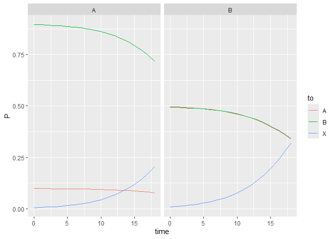
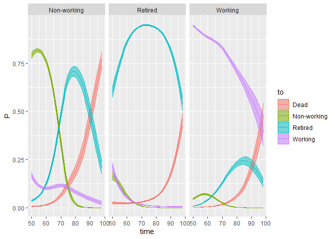

# dtms - An R package for discrete-time multistate models

<!-- badges: start -->

[](https://github.com/r-lib/usethis/actions/workflows/R-CMD-check.yaml)
[](https://lifecycle.r-lib.org/articles/stages.html#experimental)
<!-- badges: end -->

## Authors

Christian Dudel, <dudel@demogr.mpg.de>

Peng Li, <li@demogr.mpg.de>

## Overview

The package dtms implements discrete-time multistate models in R. It
comes with many tools to analyze the results of multistate models. The
workflow mainly consists of estimating a discrete-time multistate model
and then applying methods for absorbing Markov chains.

## Features

Data handling: functions for reshaping data, cleaning data, general
descriptive statistics on the data, and descriptive information on
censoring.

Estimation of transition probabilities: builds on existing R packages,
allowing for semiparametric estimation
([VGAM](https://cran.r-project.org/web/packages/VGAM)), random effects
and random intercepts
([mclogit](https://cran.r-project.org/web/packages/mclogit)), and neural
networks ([nnet](https://cran.r-project.org/web/packages/nnet)).
Functions for descriptive statistics on transition probabilities and for
plotting them are also available.

Markov chain methods: (partial) state/life expectancy, (partial)
lifetime risk, (partial) distribution of occupation time, (partial)
distribution of waiting time to first visit, (partial) distribution of
waiting time to last exit, based on (partial) distributions
variance/standard deviation and median of occupancy time and first
visit/last exit, Markov chains with rewards.

Inference: analytic standard errors and variance-covariance matrix for
transition probabilities; simulated inference using the bootstrap and
the block bootstrap.

## Disclaimer

This package is currently undergoing development and many functions are
experimental. The content of this repository will change in the future,
and functions and features might be added or removed without warning.

## Installation

You can install the development version of dtms like this:

``` r
library(devtools)
install_github("christiandudel/dtms")
```

## Workflow

The basic workflow consists of four main steps. First, the multistate
model is defined in a general way which describes the states included in
the model and its timescale. Second, the input data has to be reshaped
and cleaned. Third, a regression model is fitted to predict transition
probabilities. Fourth, Markov chain methods are applied to calculate
statistics to describe the model. These steps are described below. After
this, we present two examples which show the complete workflow based on
example data provided with the package.

## Model setup

To use the dtms package, in a first step disrete-time multistate models
are defined in a abstract way using three components: a list of the
transient states; a list of the absorbing states; and a list of values
of the time scale. Moreover, there are two additional components which
the user not necessarily needs to specify: the step length of the
timescale, and a separator (see below).

To define these components, the function `dtms()` is used. It has an
argument for each of the components, but only three are necessary: the
names of the transient states, the names of the absorbing states, and
the values of the time scale. The step length of the timescale is
implicitly defined by the values of the timescale, and the separator
uses a default value which users likely don’t want to change in a
majority of applications. In the first example provided further below,
the function `dtms()` is used like this:

``` r
## Load package
library(dtms)
## Define model: Absorbing and transient states, time scale
simple <- dtms(transient=c("A","B"),
               absorbing="X",
               timescale=0:19)
```

The arguments `transient` and `absorbing` take the names of the
transient and absorbing states, respectively, which are specified as
character vectors. In this case, there are two transient states called
`A` and `B` and an absorbing state `X`. Each model needs at least one
transient state and one absorbing state. `timescale` takes the values of
the timescale which are specified with a numeric vector. In this
example, the time scale starts at 0 and stops at 19, with a step length
of 1. The step length has to be consistent along the timescale. For
instance, a timescale with values 0, 1, 2, 4, 5, 7 is not allowed.
However, the step length does not need to equal 1; e.g., 0, 2, 4, 6, …
would be fine.

The separator is a character string used to construct what we call long
state names. Its default is `_`. Long state names consist of a
combination of the names of the transient states with values of the time
scale. They are used internally to handle that transition probabilities
might depend on values of the time scale. Long state names are never
constructed for absorbing states. For instance, if the transient states
are called `A` and `B`, the time scale can take on values 0, 1, and 2,
and the separator is `_`, then the following long state names will be
used: `A_0`, `A_1`, `A_2`, `B_0`, `B_1`, and `B_2`. Due to the temporal
ordering of states not all transitions between these states are
possible; e.g., it is not possible to transition from `A_2` to `B_0`.

## Input data

The input data has to be panel data in long format. If your data is not
in this shape, there are many tools already available in R and its
extensions which allow you to reshape it. An example of data in long
format could look like this:

| idvar | timevar | statevar | X   | Y    |
|:------|:--------|:---------|:----|:-----|
| 1     | 0       | A        | 2   | 1020 |
| 1     | 1       | A        | 2   | 1025 |
| 1     | 2       | B        | 2   | 1015 |
| 1     | 3       | A        | 2   | 1000 |
| 2     | 0       | B        | 1   | 2300 |
| 2     | 1       | A        | 1   | 2321 |
| …     | …       | …        | …   | …    |

The first variable, `idvar`, contains a unit identifier. The first four
rows of the data belong to unit `1`. The variable `timevar` has the
values of the timescale. `statevar` shows the state each unit is
occupying at a given time. `X` and `Z` are additional covariates.

The dtms package provides tools to reshape this data into what we call
transition format. For the example data shown above transition format
looks like this:

| idvar | timevar | fromvar | tovar | X   | Y    |
|:------|:--------|:--------|:------|:----|:-----|
| 1     | 0       | A       | A     | 2   | 1020 |
| 1     | 1       | A       | B     | 2   | 1025 |
| 1     | 2       | B       | A     | 2   | 1015 |
| 2     | 0       | B       | A     | 1   | 2300 |
| …     | …       | …       | …     | …   | …    |

Each row shows for each unit (`idvar`) and given time (`timevar`) the
state currently occupied (`fromvar`) and the state the unit will
transition to at the next value of the time scale (`tovar`). For unit 1,
the last observation in long format is at time 3. However, this is the
final observation and there is no transition to another state after
this. This means that the last observed transition for unit 1 starts at
time 2.

To reshape data into transition format, the function `dtms_format()` can
be used. It is one of the many functions of the package which takes the
result of the function `dtms()` as one of its inputs. In the second
example provided below `dtms_format()` is used like this:

``` r
## Load package
library(dtms)
## Define model: Absorbing and transient states, time scale
hrs <- dtms(transient=c("Working","Non-working","Retired"),
            absorbing="Dead",
            timescale=50:99)
## Reshape
estdata <- dtms_format(data=hrsdata,
                       dtms=hrs,
                       idvar="ID",
                       timevar="Age",
                       statevar="State")
```

First, `dtms()`is called to define the model. The call of
`dtms_format()` specifies the data frame which contains the data in long
format (argument `data`), the definition of the multistate model
(argument `dtms`), the name of the variable containing the unit
identifier (argument `idvar`), the name of the variable containing the
values of the timescale (argument `timevar`), and the variable
indicating the states (argument `statevar`).

Note that at this stage, the states captured by the variable specified
with `statevar` do not necessarily need to match the states in the
‘dtms’ object. In particular, this means that if there are any states in
the input data which are not in the ‘dtms’ object, there will be no
warning or similar at this stage. However, the function `dtms_clean()`
described below will remove states not included in the ‘dtms’ object by
default.

The original data and the reshaped data can be compared like this:

``` r
hrsdata |> subset(ID==3) |> head()
#>     ID Gender Age       State
#> 101  3      1  50     Working
#> 102  3      1  51     Working
#> 103  3      1  52     Working
#> 104  3      1  53     Working
#> 105  3      1  54 Non-working
#> 106  3      1  55 Non-working
estdata |> subset(id==3) |> head()
#>     id Gender time        from          to
#> 101  3      1   50     Working     Working
#> 102  3      1   51     Working     Working
#> 103  3      1   52     Working     Working
#> 104  3      1   53     Working Non-working
#> 105  3      1   54 Non-working Non-working
#> 106  3      1   55 Non-working Non-working
```

Three things are important to note. First, if not specified otherwise,
`dtms_format()` changes variable names to default names. These default
names are also default values for other functions, meaning that certain
variable names do not need to be specified all the time, making the
workflow easier. Specifically, the variable with the unit identifier
gets the name `id`; the variable with the timescale gets the name
`time`; and the variables with the starting and receiving state get the
names `from` and `to`. Other names can of course be specified, but they
have to be used consistently.

Second, the object returned by `dtms_format()` is a standard data frame.
This comes with benefits and costs. On the upside this means that data
in transition format can easily be viewed and modified using standard
tools, making it very accessible to users. The main downside is that it
does not contain general information on the model or the data, which
could make the workflow slightly more convenient. We decided to keep
intermediate steps as accessible as possible.

Third, the data in long format contains an additional variable
(`Gender`). All variables which are not `idvar`, `timevar`, or
`statevar` do not need to be specified and are handled in the same way.
For any variables X, Y, Z, … the value at time $t$ is assigned to the
transition starting in time $t$.

A useful function for handling data in transition format is
`dtms_clean()`. It can be used to remove, for instance, transitions
starting and/or ending in a missing value. Depending on the data, these
can occur quite frequently. For instance, in the example used above:

``` r
estdata |> subset(id==1) |> head()
#>   id Gender time from   to
#> 1  1      1   50 <NA> <NA>
#> 2  1      1   51 <NA> <NA>
#> 3  1      1   52 <NA> <NA>
#> 4  1      1   53 <NA> <NA>
#> 5  1      1   54 <NA> <NA>
#> 6  1      1   55 <NA> <NA>
```

This means that for the unit with ID 1, at least the first couple of
transitions only contain missing values. This is because in the original
data these values are missing:

``` r
hrsdata |> subset(ID==1) |> head()
#>   ID Gender Age State
#> 1  1      1  50  <NA>
#> 2  1      1  51  <NA>
#> 3  1      1  52  <NA>
#> 4  1      1  53  <NA>
#> 5  1      1  54  <NA>
#> 6  1      1  55  <NA>
```

Technically, this is because `dtms_format()` takes each row in the input
data and adds the state at the next value of the time scale to that row.
If this next value is NA, or if it is not included in the data, the
resulting value of \`to’ will be NA.

Such missing values and a few other things can be removed as follows:

``` r
estdata <- dtms_clean(data=estdata,
                      dtms=hrs)
#> Dropping  0  rows not in state space
#> Dropping  0  rows not in time range
#> Dropping  98287  rows starting or ending in NA
#> Dropping  51935  rows starting in absorbing state
```

## Estimating transition probabilities

Getting transition probabilities ready requires three steps. First,
estimating a regression model for the transition probabilities. Second,
predicting transition probabilities using this model. Third, putting the
transition probabilities into a transition matrix.

Estimating a regression model is done using `dtms_fit()`. Currently,
this function builds on several other packages to allow for, among other
things, semiparametric estimation and random effects. In the first
example below, we show a very basic call of this function:

``` r
## Fit model 
fit <- dtms_fit(data=estdata)
```

This will estimate a model which uses the time scale as a linear
predictor. Covariates and different functional forms can be included in
several ways. If the variables follow the naming conventions of the
package (e.g., the timescale is in `time`), then a convenient way for
including covariates is to use the argument `controls`. For example, if
in a data set there are two variables named `Z1` and `Z2`, then they
could be included as follows:

``` r
fit <- dtms_fit(data=somedata,
                covariates=c("Z1","Z2"))
```

It is also possible to specify a formula, like is common practice for
most regression functions. This way you have to specify the (standard)
names of the timescale and the state variables:

``` r
fit <- dtms_fit(data=somedata,
                formula=to~from+time+Z1+Z2)
```

What class of object is generated by `dtms_fit()` depends on the package
which is used for estimation. This is controlled by the argument
`package`, with `VGAM` as default and then using the function `vgam()`.
This means that the resulting objects of the short examples above have
class `vgam` and behave accordingly, in particular with methods for
functions like `summary()` or `coef()`. In addition to `VGAM`, currently
`mclogit` and `nnet` are supported. If the package is set to `mclogit`
the function `mblogit()` is used. If it is `nnet` the function is
`multinom()`. Arguments of these functions can be passed via
`dtms_fit()`. For instance, this includes random effects by unit ID
using the `mclogit` package:

``` r
fit <- dtms_fit(data=somedata,
                covariates=c("Z1","Z2"),
                package="mclogit",
                random=~1|id)
```

Once a regression model has been estimated, it can be used to predict
trasition probabilities. If the model includes covariates, the user
needs to specify covariate values which are used in the prediction. If
no covariates (in addition to the timescale) are included, then no
values are needed. For each time-constant covariate one value needs to
be specified, and for time-varying variables a value at each value of
the timescale has to be provided minus the last value. For instance, if
the timescale has values 0, 1, 2, and 3, and there is a time-varying
covariate X, then values for X at 0, 1, and 2 need to be specified. For
a time-constant covariate Y only one values is necessary, which is then
used at all values of the time scale.

To predict transition probabilities, the function `dtms_transitions()`
is used. It has four main arguments: `model`, `dtms`, `constant`, and
`varying`. The first argument is used to specify the object which
contains the regression model. The argument `dtms` takes the definition
of the multistate model as generated by `dtms()`. The arguments
`constant` and `varying` are only needed if there are covariates in the
model. `constant` is used for time-constant covariates, and `varying`
for time-varying covariates. Both take lists with named arguments, where
the names need to correspond to the names of the covariates in the
model. For instance, in a model with a timescale with values 0, 1, 2,
and 3, and a time-constant covariate Y and a time-varying covariate X,
the call of `dtms_transitions()` could look as follows:

``` r
probs <- dtms_transitions(model=fit,
                          dtms=example,
                          constant=list(Y=1),
                          varying=list(X=c(2,5,3))) 
```

The result of calling `dtms_transitions()` is a data frame with
predicted transition probabilities, where each row contains the
transition probability for one specific transition, as indicated by the
variables in the data. This object will often be only an intermediate
step. However, the package provides several tools to look at the
transition probabilities (see the examples below), and putting the
probabilities in a data frame makes them easily accesible to the user.

Transition probabilities in a data frame have to be converted to a
transition matrix before they can be used further. For this, we use the
function `dtms_matrix()`. In most cases, this function will only require
two arguments. First, a data frame with transition probabilities as
created with `dtms_transitions()` and passed to the argument `probs`;
and, second, a `dtms` object as created with `dtms()`. For instance, in
the first long example below, this function is used as follows:

``` r
Tp <- dtms_matrix(probs=probs,
                  dtms=simple)
```

This transition matrix can then be used to apply Markov chain methods.
The matrix itself often will not be of major interest, and it is easier
to look at transition probabilities in a data frame, as generated by
`dtms_transitions()`.

## Markov chain methods

The dtms package provides several functions which implement Markov chain
methods and which can be applied to a transition matrix generated with
`dtms_matrix()`. Most of these functions require at least two arguments.
First, a transition matrix; and, second, a ‘dtms’ object. For instance,
to calculate the lifetime spent in the different states, the function
`dtms_expectancy()` can be used:

``` r
dtms_expectancy(dtms=simple,
                matrix=Tp)
```

This and other functions are demonstrated in more detail in the two
examples below.

## Example 1: Artificial data

This is a basic example using artificial data which is provided with the
package. The state space consists of two transient states (A, B), and
one absorbing state (X). The time scale goes from 0 to 20. Transition
probabilities do change depending on time, as we will see below.

The following code loads the package and the data set. The data set is
called ‘simpledata’.

``` r
## Load package 
library(dtms)

## Look at data
head(simpledata)
#>   id time state
#> 1  1    0     A
#> 2  1    1     B
#> 3  1    2     B
#> 4  1    3     A
#> 5  1    4     B
#> 6  1    5     A

## States
simpledata$state |> unique()
#> [1] "A" "B" "X"

## Number of units
simpledata$id |> unique() |> length()
#> [1] 993

## Number of observations
dim(simpledata)
#> [1] 12173     3
```

The data set is in long format and contains three variables. ‘id’ is an
unit identifier; ‘time’ contains the value of the time scale; and
‘state’ contains the state the unit occupied at a given time. In total,
there are 993 units, each of them contributing to the total of 12,173
observations.

To work with this data set, we first define a basic discrete-time
multistate model. This is done with the function `dtms()` and requires
us to specify the names of the transient states, the names of the
absorbing states, and the possible values of the time scale:

``` r
## Define model: Absorbing and transient states, time scale
simple <- dtms(transient=c("A","B"),
               absorbing="X",
               timescale=0:19)
```

The resulting object of class ‘dtms’ can be passed to other functions of
the package, as shown below.

In a second step, we transform the data from long format to what we call
transition format. This can be done using the function `dtms_format()`.
In this example, we need to specify the name of the object containing
the data, and in addition a ‘dtms’ object as created above. Moreover, we
need to specify which variables contain the unit identifier, which
variable contains the values of the time scale, and which variable
contains the information on the state:

``` r
## Reshape to transition format
estdata <- dtms_format(data=simpledata,
                       dtms=simple,
                       idvar="id",
                       timevar="time",
                       statevar="state")
#> Kept original name for time 
#> Kept original name for id

## Look at reshaped data
head(estdata)
#>   id time from to
#> 1  1    0    A  B
#> 2  1    1    B  B
#> 3  1    2    B  A
#> 4  1    3    A  B
#> 5  1    4    B  A
#> 6  1    5    A  B
```

While in long format each row contains information on the currently
occupied state, in transition format also the next state is shown in a
variable. If there is no observation at time t+1, the next state is NA.
The names of the variables in the resulting data set are by default
chosen such that they match defaults of other functions of the package.

Depending on the original data, there can be missing values in
transition format data due to several reasons. The function
`dtms_clean()` provides a convenient way to remove such rows in the
data, as well as other potentially problematic or unwanted rows. It
returns a cleaned data set and prints a brief overview of the dropped
rows to the console:

``` r
## Missing values?
estdata$to |> table(useNA="always")
#> 
#>    A    B    X <NA> 
#> 3629 6668  616 1260

## Clean
estdata <- dtms_clean(data=estdata,
                      dtms=simple)
#> Dropping  0  rows not in state space
#> Dropping  0  rows not in time range
#> Dropping  1260  rows starting or ending in NA
#> Dropping  0  rows starting in absorbing state
```

In this example, 1,260 transitions were dropped because they end in a
missing value. No observations were dropped because the states are not
covered by the state space, no observations are dropped because they are
out of the time range specified with the ‘dtms’ object, and no
observations were dropped because they start in an absorbing state.

A brief overview of the data is provided when using the function
`summary()`:

``` r
## Summary of data
summary(estdata)
#>   from to COUNT       PROP       PROB
#> 1    A  A   384 0.03518739 0.09741248
#> 2    A  B  3398 0.31137176 0.86199899
#> 3    A  X   160 0.01466141 0.04058853
#> 4    B  A  3245 0.29735178 0.46549993
#> 5    B  B  3270 0.29964263 0.46908621
#> 6    B  X   456 0.04178503 0.06541386
```

This shows for all possible transitions the absolute number each
transition is observed (e.g., there are 160 transitions from A to X);
the proportion of each transition relative to all transitions (e.g., a
bit more than 1% of all observed transitions are from A to X); and raw
transition probabilities (e.g., the probability of transitioning to X
starting in A is around 4%).

Some more information on the data is provided by the function
`dtms_censoring()`. It can be used in different ways, but a basic
version shows an overview of the number of units with left censoring,
the number of units with gaps in their series of observations, and the
number of units with right censoring:

``` r
dtms_censoring(data=estdata,
               dtms=simple)
#> Units with left censoring:  240 
#> Units with gaps:  193 
#> Units with right censoring:  334
```

To estimate the transition probabilities of the multistate model, the
function `dtms_fit()` is used. In this simple example, it is sufficient
to specify the name of the object with the transition data:

``` r
## Fit model 
fit <- dtms_fit(data=estdata)
```

To predict transition probabilities and to arrange them in a matrix, the
functions `dtms_transitions()` and `dtms_matrix()` are used. The
function `dtms_transitions()` needs a ‘dtms’ object as well as a fitted
model, while the function `dtms_matrix()` requires a ‘dtms’ object and
predicted probabilities:

``` r
## Predict probabilities
probs    <- dtms_transitions(dtms=simple,
                             model = fit)

## Get transition matrix 
Tp <- dtms_matrix(dtms=simple,
                  probs=probs)
```

In more complex examples, the previous functions would need more
information. For instance, on which covariates to include in the
estimation step, and which covariate values to use in the prediction
step. To get an overview of the transition probabilities, the function
summary can be used:

``` r
## Summary of probabilities
summary(probs)
#>   from to    MIN MINtime    MAX MAXtime MEDIAN   MEAN
#> 1    A  A 0.0827      18 0.0994       3 0.0982 0.0956
#> 3    A  B 0.7095      18 0.8950       0 0.8640 0.8420
#> 5    A  X 0.0058       0 0.2078      18 0.0378 0.0624
#> 2    B  A 0.3530      18 0.4884       0 0.4688 0.4512
#> 4    B  B 0.3449      18 0.5018       0 0.4698 0.4527
#> 6    B  X 0.0098       0 0.3021      18 0.0614 0.0961
```

For all combinations of starting and receiving state, this shows the
lowest transition probability and at what value of the time scale it
occurs. It also shows the same for the highest transition probability,
and in addition it shows the median and the mean of all transition
probabilities between two states.

Another useful way to look at the transition probabilies is to plot
them. To make this easy, the package provides the function dtms_simplify
which can be applied to an object created with dtms_transitions to make
it easier to plot. For instance, using ggplot2, a simple plot could look
like this:

``` r
## Simple plot
library(ggplot2)
probs |>  dtms_simplify() |> 
          ggplot(aes(x=time,y=P,color=to)) + 
          geom_line() + 
          facet_wrap(~from)
```

 A
simpler way is available which builds on base-R and does not require
ggplot2. However, this creates less nice figures and is mainly intended
as a very quick way of checking results:

``` r
## Simple base plot
plot(probs,dtms=simple)
```


Before we generate more results, we calculate the starting distribution
of the states; i.e., the distribution of states at the first value of
the time scale.

``` r
## Get starting distribution 
S <- dtms_start(dtms=simple,
                data=estdata)
```

This step is not necessary, but its result can be passed to several of
the functions used for calculating results, providing additional
information.

Most functions used to calculate results need a transition matrix and a
‘dtms’ object, and potentially further arguments. The two examples below
calculate the expected time spent in a state (`dtms_expectancy`) and the
lifetime risk of ever reaching a state (`dtms_risk`). In the first case,
the starting distribution of states is passed to the function; this is
optional. In the second case, one or several states need to be specified
for which the lifetime risk os be calculated:

``` r
## State expectancies 
dtms_expectancy(dtms=simple,
                matrix=Tp,
                start_distr=S)
#>                  A        B    TOTAL
#> start:A_0 5.006818 8.700854 13.70767
#> start:B_0 4.774829 8.896551 13.67138
#> AVERAGE   4.891804 8.797876 13.68968

## Lifetime risk 
dtms_risk(dtms=simple,
          matrix=Tp,
          risk="A")
#>      A_0      B_0 
#> 1.000000 0.974725
```

The results of the call of `dtms_expectancy()` show the starting states
in rows and the states in which the time is spent as columns. For
instance, around 5.05 time units are spent in state A when starting in
state A at time 0. The last column shows the total time until
absorbtion. The last row is shown because the starting distribution was
specified. It shows the average time spent in a state irrespective of
the starting state. That is, on average 4.93 time units are spent in
state A, 8.88 time units are spent in state B, for a total of 13.81 time
units.

The result of the call of `dtms_risk()` above is the lifetime risk of
ever reaching state A depending on the starting state. Obviously, when
starting in state A at time 0, this risk amounts to 1. When starting in
state B, the risk is also very high and around 97%.

It is also possible to calculate state expectancies conditional on
values of the time scale. For this, a single transient state has to be
specified for which we want to know how long units spent in it:

``` r
dtms_expectancy(dtms=simple,
                risk="A",
                matrix=Tp)
#>          0        1        2        3        4        5        6        7
#> A 5.006818 4.694051 4.387121 4.086756 3.793721 3.508792 3.232746 2.966329
#> B 4.774829 4.460056 4.150827 3.847848 3.551860 3.263624 2.983902 2.713433
#>          8        9       10       11       12       13       14       15
#> A 2.710219 2.464994 2.231025 2.008520 1.797071 1.596393 1.403558 1.219479
#> B 2.452900 2.202883 1.963824 1.735883 1.519020 1.312339 1.115226 0.923136
#>          16        17        18  19
#> A 1.0284166 0.8538373 0.5827048 0.5
#> B 0.7377421 0.5341427 0.3529947 0.0
```

In the example aboce, we look at the time spent in state A. The results
by row now indicate the remaining life expectancy in state A starting
from the state in the row at a given time. For instance, if a unit is in
state A at time 5, an additional 3.51 time units will be spent in state
A (as seen in row named “A”, column named “5”).

The function calls below are all similar in that they provide full
distributions as a result. Specifically, `dtms_visits()` calculates the
distribution of the time spent in a state; the mean over this
distribution is equal to the state expectancy as provided by
`dtms_expectancy()`, and the one minus the proportion of 0 time units
spent in a state is equal to the lifetime risk provided by
`dtms_risk()`. `dtms_first()` calculates the distribution of the waiting
time until a given state is reached for the first time, conditional on
ever reaching this state. `dtms_last()` calculates the distribution of
the waiting time until a state is left for the last time; i.e., there is
no return back to this state.

``` r
## Distribution of visits
dtms_visits(dtms=simple,
            matrix=Tp,
            risk="A",
            start_distr=S)
#>                         0           0.5          1        1.5          2
#> start:A_0      0.00000000  3.344800e-02 0.00000000 0.05798264 0.00000000
#> start:B_0      0.02527496 -3.469447e-18 0.05016242 0.00000000 0.08200508
#> AVERAGE        0.01253069  1.686533e-02 0.02486925 0.02923632 0.04065604
#> AVERAGE(COND.) 0.02527496 -3.469447e-18 0.05016242 0.00000000 0.08200508
#>                          2.5             3        3.5          4        4.5
#> start:A_0       9.272739e-02 -2.775558e-17 0.13278564 0.00000000 0.16612892
#> start:B_0      -2.775558e-17  1.210458e-01 0.00000000 0.15724305 0.00000000
#> AVERAGE         4.675550e-02  6.001144e-02 0.06695389 0.07795712 0.08376641
#> AVERAGE(COND.) -2.775558e-17  1.210458e-01 0.00000000 0.15724305 0.00000000
#>                         5        5.5          6        6.5          7
#> start:A_0      0.00000000 0.17786454 0.00000000 0.15780490 0.00000000
#> start:B_0      0.17606542 0.00000000 0.16547248 0.00000000 0.12398646
#> AVERAGE        0.08728877 0.08968381 0.08203706 0.07956923 0.06146934
#> AVERAGE(COND.) 0.17606542 0.00000000 0.16547248 0.00000000 0.12398646
#>                       7.5          8        8.5          9         9.5
#> start:A_0      0.10881912 0.00000000 0.05290557 0.00000000 0.016290535
#> start:B_0      0.00000000 0.06803989 0.00000000 0.02464253 0.000000000
#> AVERAGE        0.05486936 0.03373245 0.02667633 0.01221714 0.008214101
#> AVERAGE(COND.) 0.00000000 0.06803989 0.00000000 0.02464253 0.000000000
#>                         10        10.5           11         11.5           12
#> start:A_0      0.000000000 0.002926048 0.0000000000 0.0002983776 0.000000e+00
#> start:B_0      0.005353188 0.000000000 0.0006604016 0.0000000000 4.634940e-05
#> AVERAGE        0.002653975 0.001475388 0.0003274104 0.0001504495 2.297886e-05
#> AVERAGE(COND.) 0.005353188 0.000000000 0.0006604016 0.0000000000 4.634940e-05
#>                         12.5            13         13.5           14
#> start:A_0       1.767521e-05 -2.220446e-16 6.331159e-07 0.000000e+00
#> start:B_0      -1.110223e-16  1.915403e-06 0.000000e+00 4.832799e-08
#> AVERAGE         8.912289e-06  9.496080e-07 3.192331e-07 2.395979e-08
#> AVERAGE(COND.) -1.110223e-16  1.915403e-06 0.000000e+00 4.832799e-08
#>                        14.5           15         15.5           16         16.5
#> start:A_0      1.418449e-08 0.000000e+00 2.023649e-10 0.000000e+00 1.831979e-12
#> start:B_0      0.000000e+00 7.612809e-10 0.000000e+00 7.491119e-12 0.000000e+00
#> AVERAGE        7.152182e-09 3.774238e-10 1.020375e-10 3.713907e-12 9.237303e-13
#> AVERAGE(COND.) 0.000000e+00 7.612809e-10 0.000000e+00 7.491119e-12 0.000000e+00
#>                          17         17.5 18 18.5            19         19.5 20
#> start:A_0      0.000000e+00 1.021405e-14  0    0 -2.220446e-16 2.220446e-16  0
#> start:B_0      4.485301e-14 0.000000e+00  0    0  0.000000e+00 0.000000e+00  0
#> AVERAGE        2.223699e-14 5.150184e-15  0    0 -1.119605e-16 1.119605e-16  0
#> AVERAGE(COND.) 4.485301e-14 0.000000e+00  0    0  0.000000e+00 0.000000e+00  0
#>                        20.5
#> start:A_0      2.220446e-16
#> start:B_0      2.220446e-16
#> AVERAGE        2.220446e-16
#> AVERAGE(COND.) 2.220446e-16
#> attr(,"class")
#> [1] "dtms_distr" "matrix"

## Distribution of waiting time to first visit
dtms_first(dtms=simple,
           matrix=Tp,
           risk="A",
           start_distr=S)
#>                        0       0.5       1.5        2.5        3.5        4.5
#> start:A_0      1.0000000 0.0000000 0.0000000 0.00000000 0.00000000 0.00000000
#> start:B_0      0.0000000 0.5010276 0.2512180 0.12543490 0.06232800 0.03079645
#> AVERAGE        0.5106239 0.2451909 0.1229401 0.06138484 0.03050183 0.01507104
#> AVERAGE(COND.) 0.0000000 0.5010276 0.2512180 0.12543490 0.06232800 0.03079645
#>                        5.5         6.5         7.5          8.5          9.5
#> start:A_0      0.000000000 0.000000000 0.000000000 0.0000000000 0.0000000000
#> start:B_0      0.015116437 0.007362339 0.003552826 0.0016957606 0.0007988565
#> AVERAGE        0.007397623 0.003602953 0.001738668 0.0008298648 0.0003909413
#> AVERAGE(COND.) 0.015116437 0.007362339 0.003552826 0.0016957606 0.0007988565
#>                        10.5         11.5         12.5         13.5         14.5
#> start:A_0      0.0000000000 0.000000e+00 0.000000e+00 0.000000e+00 0.000000e+00
#> start:B_0      0.0003704930 1.686444e-04 7.506966e-05 3.253792e-05 1.366336e-05
#> AVERAGE        0.0001813104 8.253052e-05 3.673730e-05 1.592328e-05 6.686524e-06
#> AVERAGE(COND.) 0.0003704930 1.686444e-04 7.506966e-05 3.253792e-05 1.366336e-05
#>                        15.5         16.5         17.5 TOTAL(RESCALED)
#> start:A_0      0.000000e+00 0.000000e+00 0.000000e+00               1
#> start:B_0      5.526197e-06 2.138358e-06 7.856347e-07               1
#> AVERAGE        2.704389e-06 1.046462e-06 3.844709e-07               1
#> AVERAGE(COND.) 5.526197e-06 2.138358e-06 7.856347e-07               1
#> attr(,"class")
#> [1] "dtms_distr" "matrix"

## Distribution of waiting time to last exit
dtms_last(dtms=simple,
          matrix=Tp,
          risk="A",
          start_distr=S,
          rescale=T,
          total=F)
#>                       0.5         1.5        2.5        3.5        4.5
#> start:A_0      0.03344862 0.004045972 0.02216475 0.01841978 0.02582569
#> start:B_0      0.00000000 0.020434867 0.01493956 0.02251011 0.02469741
#> AVERAGE        0.01707967 0.012066305 0.01862892 0.02042149 0.02527354
#> AVERAGE(COND.) 0.00000000 0.020434867 0.01493956 0.02251011 0.02469741
#>                       5.5        6.5        7.5        8.5        9.5
#> start:A_0      0.02880081 0.03469428 0.04000662 0.04623384 0.05244868
#> start:B_0      0.03027824 0.03512111 0.04110841 0.04722560 0.05370060
#> AVERAGE        0.02952383 0.03490316 0.04054581 0.04671918 0.05306134
#> AVERAGE(COND.) 0.03027824 0.03512111 0.04110841 0.04722560 0.05370060
#>                      10.5       11.5       12.5       13.5       14.5
#> start:A_0      0.05872871 0.06459506 0.06978833 0.07408259 0.07770617
#> start:B_0      0.06007381 0.06609947 0.07140288 0.07580110 0.07950678
#> AVERAGE        0.05938697 0.06533128 0.07057845 0.07492359 0.07858735
#> AVERAGE(COND.) 0.06007381 0.06609947 0.07140288 0.07580110 0.07950678
#>                      15.5       16.5      17.5       18.5
#> start:A_0      0.08178381 0.08894421 0.1006557 0.07762634
#> start:B_0      0.08367974 0.09100577 0.1029889 0.07942565
#> AVERAGE        0.08271163 0.08995309 0.1017975 0.07850688
#> AVERAGE(COND.) 0.08367974 0.09100577 0.1029889 0.07942565
#> attr(,"class")
#> [1] "dtms_distr" "matrix"
```

The output from these functions tends to be difficult to read, and often
results on the distribution are used to calculate other statistics. A
small set of such statistics can be generated using the function
`summary()`:

``` r
## Distribution of visits
example <- dtms_visits(dtms=simple,
                       matrix=Tp,
                       risk="A",
                       start_distr=S)
summary(example)
#>                    MEAN VARIANCE       SD MEDIAN      RISK0
#> start:A_0      5.006818 4.467193 2.113573    5.5 0.00000000
#> start:B_0      4.774829 4.591303 2.142733    5.0 0.02527496
#> AVERAGE        4.891804 4.542177 2.131238    5.0 0.01253069
#> AVERAGE(COND.) 4.774829 4.591303 2.142733    5.0 0.02527496
```

In the example above this returns, respectively, the average lifetime
spent in state A; the variance of the lifetime spent in state A; the
standard deviation of the lifetime spent in state A; the median of the
lifetime spent in state A; and the probability of spending zero lifetime
in state A. Depending on which distribution this function is applied to,
some entries might not be defined. For instance:

``` r
## Distribution of waiting time to last exit
example2 <- dtms_last(dtms=simple,
                      matrix=Tp,
                      risk="A",
                      start_distr=S,
                      rescale=T,
                      total=F)
summary(example2)
#>                    MEAN VARIANCE       SD MEDIAN RISK0
#> start:A_0      12.12560 23.55401 4.853247   13.5    NA
#> start:B_0      12.40256 20.71913 4.551827   13.5    NA
#> AVERAGE        12.26114 22.18586 4.710186   13.5    NA
#> AVERAGE(COND.) 12.40256 20.71913 4.551827   13.5    NA
```

In this case, the distribution is conditional on ever experiencing the
exit from state A, such that the waiting time until exit always has to
be above 0.

With respect to inference, the package currently provides analytic
standard errors for transition probabilities, and simulated inference
for all other statistics. Standard errors for transition probabilities
are provided by default by the function `dtms_transitions()`, and it can
also return confidence intervals. Two methods for simulated inference
are implemented: the (simple) bootstrap and the block bootstrap. Both
methods are provided by the function `dtms_boot()`. How to use
`dtms_transitions()` and `dtms_boot()` for inference is demonstrated in
the second example below.

## Example 2: Working trajectories during late working life

Here we provide an example using simulated data based on the Health and
Retirement Study (HRS). The simulations are are conducted using
transition probabilities estimated from the HRS and published by Dudel &
Myrskylä (2017) who studied working trajectories in late working life
and old age. These transition probabilities are used to simulate
artificial but realistic trajectories. There are three transient states
(working, non-working, retired) and one absorbing state (dead). The time
scale represents age and ranges from 50 to 99, as the focus is on older
individuals. Note that the actual HRS data is collected every two years
and while the simulated data is annual. The data set also contains each
individual’s gender, and the transition probabilities underlying the
simulated trajectories differ between men and women.

The workflow is similar to the previous example. First, a ‘dtms’ model
is defined using the function \`dtms’. Second, the data is brought into
transition format and cleaned. Third, transition probabilities are
estimated and put into a transition matrix. In this example,
probabilities are estimated and predicted using time-constant and
time-varying covariates, and the probabilities are plotted together with
confidence intervals. Finally, the transition matrix is used to
calculate state expectancies and similar measures.

``` r
## Load packages
library(dtms)
library(ggplot2)

## Define model: Absorbing and transient states, time scale
hrs <- dtms(transient=c("Working","Non-working","Retired"),
            absorbing="Dead",
            timescale=50:99)

## Quick look at data
head(hrsdata)
#>   ID Gender Age State
#> 1  1      1  50  <NA>
#> 2  1      1  51  <NA>
#> 3  1      1  52  <NA>
#> 4  1      1  53  <NA>
#> 5  1      1  54  <NA>
#> 6  1      1  55  <NA>

## Reshape
estdata <- dtms_format(data=hrsdata,
                       dtms=hrs,
                       idvar="ID",
                       timevar="Age",
                       statevar="State")

## Drop dead-to-dead transitions etc
estdata <- dtms_clean(data=estdata,
                      dtms=hrs)
#> Dropping  0  rows not in state space
#> Dropping  0  rows not in time range
#> Dropping  98287  rows starting or ending in NA
#> Dropping  51935  rows starting in absorbing state

## Overview
summary(estdata)
#>           from          to COUNT        PROP        PROB
#> 1  Non-working        Dead   197 0.001974383 0.013936050
#> 2  Non-working Non-working 10635 0.106586622 0.752334465
#> 3  Non-working     Retired  1900 0.019042274 0.134408602
#> 4  Non-working     Working  1404 0.014071238 0.099320883
#> 5      Retired        Dead  2602 0.026077893 0.051556401
#> 6      Retired Non-working   606 0.006073483 0.012007371
#> 7      Retired     Retired 46423 0.465262884 0.919831976
#> 8      Retired     Working   838 0.008398645 0.016604252
#> 9      Working        Dead   306 0.003066808 0.008699855
#> 10     Working Non-working  2066 0.020705967 0.058738237
#> 11     Working     Retired  2178 0.021828459 0.061922497
#> 12     Working     Working 30623 0.306911343 0.870639411

## Basic censoring
dtms_censoring(data=estdata,
               dtms=hrs)
#> Units with left censoring:  2036 
#> Units with gaps:  1720 
#> Units with right censoring:  1323

## More advanced censoring example
estdata <- dtms_censoring(data=estdata,
                          dtms=hrs,
                          add=T,
                          addtype="obs")
#> Units with left censoring:  2036 
#> Units with gaps:  1720 
#> Units with right censoring:  1323

estdata |>
  subset(subset=to!="Dead",select=c(RIGHT,to)) |>
  table() |>
  prop.table(margin=1)
#>        to
#> RIGHT   Non-working    Retired    Working
#>   FALSE  0.13846880 0.51950708 0.34202412
#>   TRUE   0.07860922 0.73015873 0.19123205

## Add age squared
estdata$time2 <- estdata$time^2
  
## Fit model
fit <- dtms_fit(data=estdata,
                controls=c("Gender","time2"))

## Transition probabilities by gender
  
# Men
probs_m <- dtms_transitions(dtms=hrs,
                            model = fit,
                            constant = list(Gender=0),
                            varying = list(time2 = (50:98)^2),
                            CI=TRUE)
  
# Women
probs_w <- dtms_transitions(dtms=hrs,
                            model = fit,
                            constant = list(Gender=1),
                            varying = list(time2 = (50:98)^2),
                            CI=TRUE)

# Overview
summary(probs_m)
#>           from          to    MIN MINtime    MAX MAXtime MEDIAN   MEAN
#> 1  Non-working        Dead 0.0064      50 0.7701      98 0.1080 0.2055
#> 4  Non-working Non-working 0.0000      98 0.8173      54 0.1402 0.3186
#> 7  Non-working     Retired 0.0356      50 0.7089      79 0.3904 0.3880
#> 10 Non-working     Working 0.0238      98 0.1668      50 0.1008 0.0879
#> 2      Retired        Dead 0.0231      58 0.4588      98 0.0364 0.0930
#> 5      Retired Non-working 0.0000      98 0.1627      50 0.0025 0.0324
#> 8      Retired     Retired 0.5365      98 0.9492      73 0.8855 0.8381
#> 11     Retired     Working 0.0047      98 0.2132      50 0.0121 0.0365
#> 3      Working        Dead 0.0013      50 0.4725      98 0.0288 0.0926
#> 6      Working Non-working 0.0000      98 0.0704      58 0.0104 0.0252
#> 9      Working     Retired 0.0075      50 0.2443      85 0.1524 0.1375
#> 12     Working     Working 0.3990      98 0.9456      50 0.7862 0.7447
summary(probs_w)
#>           from          to    MIN MINtime    MAX MAXtime MEDIAN   MEAN
#> 1  Non-working        Dead 0.0036      50 0.6979      98 0.0743 0.1649
#> 4  Non-working Non-working 0.0000      98 0.8565      54 0.1780 0.3471
#> 7  Non-working     Retired 0.0296      50 0.7504      80 0.4309 0.4090
#> 10 Non-working     Working 0.0297      98 0.1312      50 0.0822 0.0791
#> 2      Retired        Dead 0.0156      57 0.3678      98 0.0253 0.0687
#> 5      Retired Non-working 0.0000      98 0.2013      50 0.0032 0.0404
#> 8      Retired     Retired 0.5857      50 0.9600      74 0.9001 0.8567
#> 11     Retired     Working 0.0052      98 0.1966      50 0.0115 0.0341
#> 3      Working        Dead 0.0009      50 0.3908      98 0.0208 0.0718
#> 6      Working Non-working 0.0000      98 0.0922      58 0.0138 0.0332
#> 9      Working     Retired 0.0078      50 0.2633      86 0.1700 0.1488
#> 12     Working     Working 0.4542      98 0.9311      50 0.7815 0.7462

# Plotting, men as example
probs_m |>  dtms_simplify() |> 
            ggplot(aes(x=time,y=P,color=to)) + 
            geom_ribbon(aes(ymin = CIlow, ymax = CIup,fill=to),alpha=0.5) +
            geom_line() + 
            facet_wrap(~from)
```



``` r
 
## Transition matrices
Tm <- dtms_matrix(dtms=hrs,
                  probs=probs_m)
  
Tw <- dtms_matrix(dtms=hrs,
                  probs=probs_w)

## Starting distributions
Sm <- dtms_start(dtms=hrs,
                 data=estdata,
                 variables=list(Gender=0))
  
Sw <- dtms_start(dtms=hrs,
                 data=estdata,
                 variables=list(Gender=1))
  
## State expectancies
dtms_expectancy(dtms=hrs,
                matrix=Tm,
                start_distr=Sm)
#>                        Working Non-working  Retired    TOTAL
#> start:Working_50     13.307334    3.074605 13.53758 29.91952
#> start:Non-working_50  8.782989    6.496935 13.75116 29.03108
#> start:Retired_50      8.821763    3.905134 15.19067 27.91757
#> AVERAGE              12.445981    3.589228 13.65526 29.69047
    
dtms_expectancy(dtms=hrs,
                matrix=Tw,
                start_distr=Sw)
#>                        Working Non-working  Retired    TOTAL
#> start:Working_50     12.066485    4.386659 16.53253 32.98567
#> start:Non-working_50  7.445512    8.199122 16.77896 32.42359
#> start:Retired_50      7.836675    5.486704 18.24103 31.56440
#> AVERAGE              10.450573    5.607548 16.68838 32.74651

## Variant: ignoring retirement as a starting state (shown only for men)
limited <- c("Working","Non-working")

Smwr <- dtms_start(dtms=hrs,
                   data=estdata,
                   start_state=limited,
                   variables=list(Gender=0))

dtms_expectancy(dtms=hrs,
                matrix=Tm,
                start_state=limited,
                start_distr=Smwr)
#>                        Working Non-working  Retired    TOTAL
#> start:Working_50     13.307334    3.074605 13.53758 29.91952
#> start:Non-working_50  8.782989    6.496935 13.75116 29.03108
#> AVERAGE              12.650574    3.571394 13.56859 29.79056

## Lifetime risk of reaching retirement
dtms_risk(dtms=hrs,
          matrix=Tm,
          risk="Retired",
          start_distr=Sm)
#>     Working_50 Non-working_50     Retired_50        AVERAGE AVERAGE(COND.) 
#>      0.8828701      0.8806115      1.0000000      0.8888186      0.8825422
  
dtms_risk(dtms=hrs,
          matrix=Tw,
          risk="Retired",
          start_distr=Sw)
#>     Working_50 Non-working_50     Retired_50        AVERAGE AVERAGE(COND.) 
#>      0.9172407      0.9159547      1.0000000      0.9207352      0.9168268
  
## Distribution of visits
visitsm <- dtms_visits(dtms=hrs,
                       matrix=Tm,
                       risk="Retired",
                       start_distr=Sm)
  
visitsw <- dtms_visits(dtms=hrs,
                       matrix=Tw,
                       risk="Retired",
                       start_distr=Sw,
                       method="end")

summary(visitsm)
#>                          MEAN  VARIANCE        SD MEDIAN     RISK0
#> start:Working_50     13.53758  97.35708  9.866969   13.0 0.1171299
#> start:Non-working_50 13.75116 103.70848 10.183736   13.0 0.1193885
#> start:Retired_50     15.19067 112.59117 10.610899   14.5 0.0000000
#> AVERAGE              13.65526  99.18227  9.959030   13.0 0.1111814
#> AVERAGE(COND.)       13.56859  98.28472  9.913865   13.0 0.1174578
summary(visitsw)
#>                          MEAN VARIANCE       SD MEDIAN      RISK0
#> start:Working_50     17.44977 112.1093 10.58817     18 0.08275934
#> start:Non-working_50 17.69491 117.8990 10.85813     18 0.08404534
#> start:Retired_50     18.74103 124.6118 11.16296     19 0.00000000
#> AVERAGE              17.58562 114.5507 10.70284     18 0.07926479
#> AVERAGE(COND.)       17.52865 113.9856 10.67640     18 0.08317318
  
## First visit
firstm <- dtms_first(dtms=hrs,
                     matrix=Tm,
                     risk="Retired",
                     start_distr=Sm)  
  
firstw <- dtms_first(dtms=hrs,
                     matrix=Tw,
                     risk="Retired",
                     start_distr=Sw)  

summary(firstm)
#> Warning in dtms_distr_summary(distr = object, ...): NAs introduced by coercion
#>                          MEAN VARIANCE       SD MEDIAN      RISK0
#> start:Working_50     14.25887 42.52401 6.521043   14.5 0.00000000
#> start:Non-working_50 12.31587 50.90513 7.134783   12.5 0.00000000
#> start:Retired_50      0.00000  0.00000 0.000000    0.0 1.00000000
#> AVERAGE              13.13712 52.58727 7.251708   13.5 0.06011927
#> AVERAGE(COND.)       13.97744 44.20558 6.648728   13.5 0.00000000
summary(firstw)
#> Warning in dtms_distr_summary(distr = object, ...): NAs introduced by coercion
#>                          MEAN VARIANCE       SD MEDIAN      RISK0
#> start:Working_50     14.10717 40.00302 6.324794   14.5 0.00000000
#> start:Non-working_50 12.54709 46.49749 6.818907   12.5 0.00000000
#> start:Retired_50      0.00000  0.00000 0.000000    0.0 1.00000000
#> AVERAGE              12.91123 49.41190 7.029360   13.5 0.05103632
#> AVERAGE(COND.)       13.60562 42.62186 6.528542   13.5 0.00000000

## Last exit
  
# Leaving work to any state
last1m <- dtms_last(dtms=hrs,
                    matrix=Tm,
                    risk="Working",
                    start_distr=Sm)  
  
last1w <- dtms_last(dtms=hrs,
                    matrix=Tw,
                    risk="Working",
                    start_distr=Sw) 

summary(last1m)
#> Warning in dtms_distr_summary(distr = object, ...): NAs introduced by coercion
#>                          MEAN VARIANCE       SD MEDIAN RISK0
#> start:Working_50     16.50265 76.98676 8.774210   15.5    NA
#> start:Non-working_50 18.02302 68.14259 8.254853   17.5    NA
#> start:Retired_50     17.83146 69.33252 8.326615   17.5    NA
#> AVERAGE              16.73797 75.91238 8.712771   16.5    NA
#> AVERAGE(COND.)       17.97027 68.47754 8.275116   17.5    NA
summary(last1w)
#> Warning in dtms_distr_summary(distr = object, ...): NAs introduced by coercion
#>                          MEAN VARIANCE       SD MEDIAN RISK0
#> start:Working_50     16.15218 87.76963 9.368545   15.5    NA
#> start:Non-working_50 18.31738 77.06422 8.778623   17.5    NA
#> start:Retired_50     17.94411 78.93510 8.884543   17.5    NA
#> AVERAGE              16.78741 85.57486 9.250668   16.5    NA
#> AVERAGE(COND.)       18.26738 77.33095 8.793802   17.5    NA
  
# Leaving work for retirement
last2m <- dtms_last(dtms=hrs,
                    matrix=Tm,
                    risk="Working",
                    risk_to="Retired",
                    start_distr=Sm)  
  
last2w <- dtms_last(dtms=hrs,
                    matrix=Tw,
                    risk="Working",
                    risk_to="Retired",
                    start_distr=Sw)  

summary(last2m)
#> Warning in dtms_distr_summary(distr = object, ...): NAs introduced by coercion
#>                          MEAN VARIANCE       SD MEDIAN RISK0
#> start:Working_50     18.74988 64.64429 8.040167   18.5    NA
#> start:Non-working_50 19.72542 56.78054 7.535286   19.5    NA
#> start:Retired_50     19.60618 57.79592 7.602363   19.5    NA
#> AVERAGE              18.90783 63.49802 7.968565   18.5    NA
#> AVERAGE(COND.)       19.69276 57.06149 7.553906   19.5    NA
summary(last2w)
#> Warning in dtms_distr_summary(distr = object, ...): NAs introduced by coercion
#>                          MEAN VARIANCE       SD MEDIAN RISK0
#> start:Working_50     19.33660 73.65218 8.582085   19.5    NA
#> start:Non-working_50 20.62023 63.26114 7.953687   20.5    NA
#> start:Retired_50     20.40228 64.97334 8.060604   20.5    NA
#> AVERAGE              19.73733 70.75006 8.411305   19.5    NA
#> AVERAGE(COND.)       20.59143 63.49278 7.968235   20.5    NA

# Bootstrap example (not run)
# bootfun <- function(data,dtms) {
# 
#   fit <- dtms_fit(data=data,
#                   controls=c("Gender","time2"),
#                   package="mclogit")
# 
#   probs_m <- dtms_transitions(dtms=dtms,
#                               model = fit,
#                               constant = list(Gender=0),
#                               varying = list(time2 = (50:98)^2),
#                               CI=TRUE)
# 
#   probs_w <- dtms_transitions(dtms=dtms,
#                               model = fit,
#                               constant = list(Gender=1),
#                               varying = list(time2 = (50:98)^2))
# 
#   Tm <- dtms_matrix(dtms=dtms,
#                     probs=probs_m)
# 
#   Tw <- dtms_matrix(dtms=dtms,
#                     probs=probs_w)
# 
#   Sm <- dtms_start(dtms=dtms,
#                    data=data,
#                    variables=list(Gender=0))
# 
#   Sw <- dtms_start(dtms=dtms,
#                    data=data,
#                    variables=list(Gender=1))
# 
#   res1 <- dtms_expectancy(dtms=dtms,
#                   matrix=Tm,
#                   start_distr=Sm)
# 
#   res2 <- dtms_expectancy(dtms=dtms,
#                   matrix=Tw,
#                   start_distr=Sw)
# 
#   rbind(res1,res2)
# 
# }
# 
# bootresults <- dtms_boot(data=estdata,
#                          dtms=hrs,
#                          fun=bootfun,
#                          idvar="id",
#                          rep=50,
#                          method="block",
#                          seed=321,
#                          parallel=TRUE)
# 
# summary(bootresults)
```
